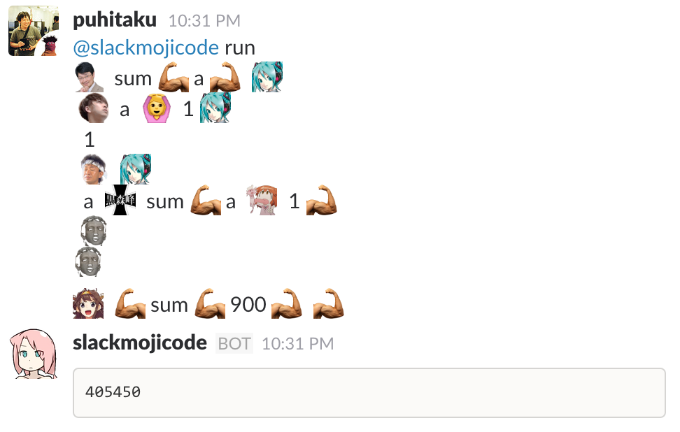
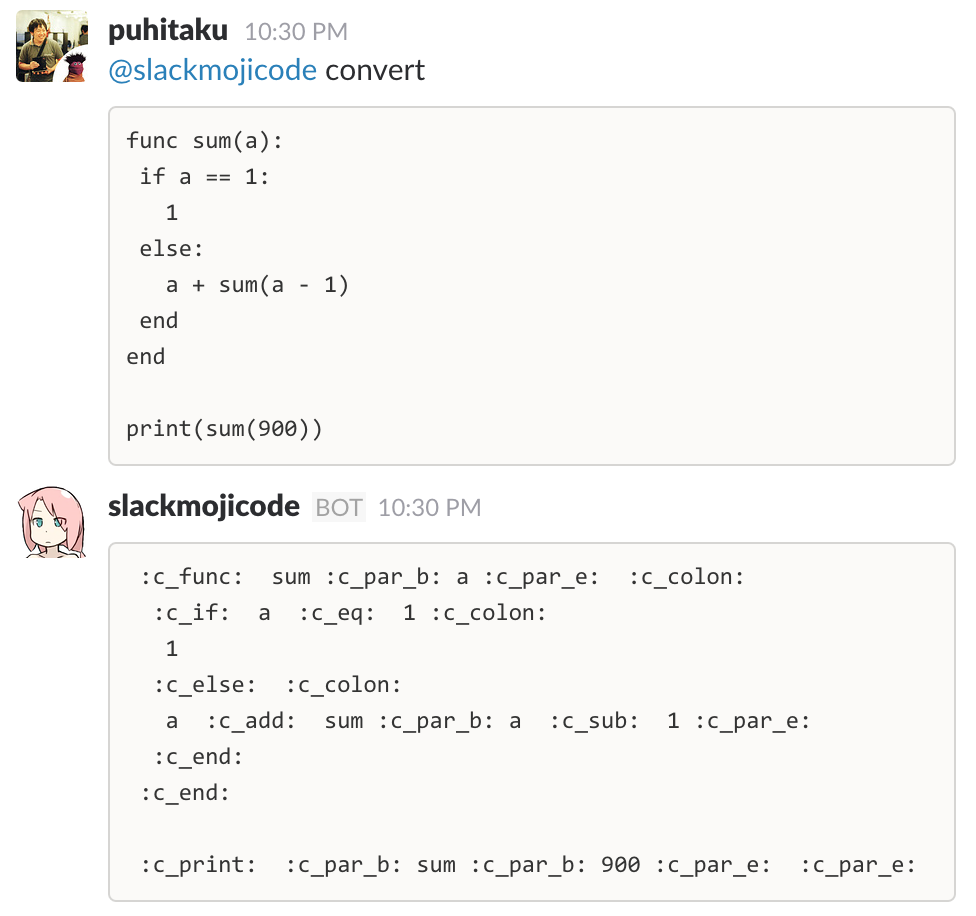

# SlackMojicode

**Programming emoji interpreter works on Slack as a bot.**

This language is based on joshsharp's [Braid](https://github.com/joshsharp/braid) which is introduced in [his article](http://joshsharp.com.au/blog/view/rpython-rply-interpreter-1) of introduction of RPython. I want to say thank you for this work.

Tokens are replaced with emoji-style one as you see in below picture, and you can find assinments [here](slackmojicode/lexer.py).

## Prerequisites / Install

 - Works on Python 2.7
 - `pip install -r requirements.txt`
 - Add your Slack bot's token in `rtmbot.conf`
 - Execute `rtmbot`

## Running

 - Execute `rtmbot`

## Modification

Some modifications from Braid was applied:

 - Non-immutable variable (re-assignable)
 - Re-implemented print function
 - Decreased / replaced tokens

